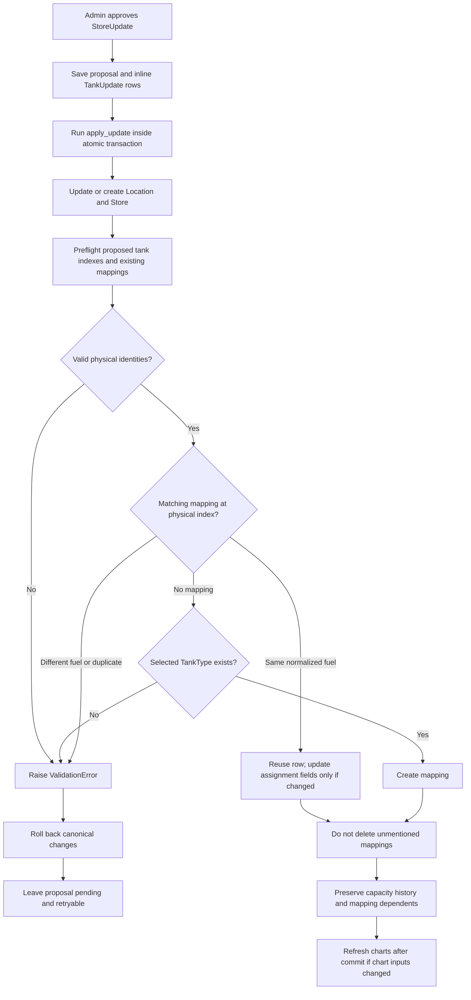
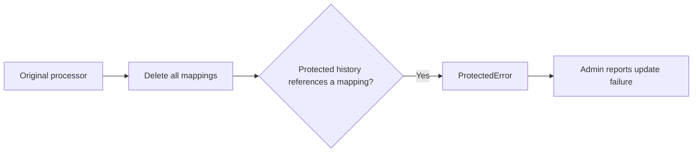

# Store Update Tank Mappings and Protected Capacity History

## What happened

The reported error happened when the original store-update processor deleted all
`StoreTankMapping` rows for a store before recreating them from the proposal.
Some mappings had related `TankCapacityProfileHistory` records. Because the
history model's foreign key uses `on_delete=PROTECT`, Django rejected deletion
and the admin displayed a `ProtectedError`.

The immediate fix now uses a non-destructive upsert. It keeps the existing
mapping row for the same physical tank, creates validated new mappings, and
leaves mappings not mentioned in the proposal unchanged. History protection
remains enabled.

## Diagram

The original failing path was:

## Code flow

### Approval through the admin action

1. `siteintel/admin/proposal_admin.py:StoreUpdateAdmin.approve_and_apply` selects
   pending proposals and invokes `StoreUpdate.apply_update()`.
2. `siteintel/models/proposal_models.py:StoreUpdate.apply_update` delegates to
   `siteintel.logic.proposal_processor.apply_proposal`.
3. `apply_proposal` verifies approval and wraps canonical synchronization in
   `transaction.atomic()`.
4. It creates or updates the related `siteintel.Location`, then routes store
   records through `_sync_store`.
5. `_sync_store` updates or creates the `tankgauge.Store`, reads the proposal's
   `TankUpdate` rows, and delegates them to
   `siteintel.logic.tank_mapping_sync.sync_store_tank_mappings`.
6. The synchronizer validates the entire proposed set before mapping writes:
   indexes must be positive and unique; an existing physical index must have at
   most one mapping; normalized fuel must agree; and a new mapping must have a
   selected `TankType`.
7. It reuses a matching mapping by physical index and normalized fuel, updates
   only proposal-owned assignment fields, creates missing validated mappings,
   and leaves omitted mappings unchanged.
8. Capacity profile fields, mapping primary keys, capacity history, mapped tank
   estimates, and estimate-sync references remain attached to their original
   mapping rows.

### Approval through the change form

Django saves the parent model in `save_model` before saving inline formsets in
`save_related`. Applying the proposal in `save_model` would therefore read old
`TankUpdate` rows when an administrator edits tanks and approves in the same
form submission. The admin now applies from `StoreUpdateAdmin.save_related`,
after the submitted tank inlines are saved.

If synchronization fails, its atomic block rolls back canonical changes. The
change-form admin restores the proposal's previous status and approval metadata,
but keeps the submitted proposal/inlines so they can be corrected and retried.
The bulk action leaves failed proposals pending because `apply_proposal` only
saves the proposal after synchronization succeeds. A newly created proposal
that fails approval returns to `PENDING` with no approval metadata.

When a mapping's chart-relevant assignment or capacity fields change, a
`tankcharts` post-save signal schedules store-chart regeneration with
`transaction.on_commit`. Unchanged mappings are not saved, and notes-only
updates do not trigger regeneration.

## Database models and schema

The default Django table names are shown below. `id` is each model's generated
primary key. User foreign keys reference the configured auth user model. The
project's generated schema is also maintained in
[`instructions/database_schema.dbml`](instructions/database_schema.dbml).

### Proposal and site models

#### `siteintel.StoreUpdate` — `siteintel_storeupdate`

| Field | Schema | Relationship / purpose |
|---|---|---|
| `id` | Generated primary key | Proposal identifier. |
| `location` | Nullable FK, `SET_NULL` | `siteintel.Location`. |
| `store` | Nullable FK, `SET_NULL` | Canonical `tankgauge.Store`. |
| `status` | `CharField(20)`, choices `PENDING`/`APPROVED`/`REJECTED`, default `PENDING` | Approval lifecycle. |
| `location_type` | Nullable FK, `SET_NULL` | `siteintel.LocationType`; selects specialized sync behavior. |
| `submitted_by` | Required FK, `CASCADE` | Auth user who submitted the proposal. |
| `submitted_at` | `DateTimeField(auto_now_add=True)` | Submission time. |
| `approved_by` | Nullable FK, `SET_NULL` | Approving auth user. |
| `approved_at` | Nullable `DateTimeField` | Approval time. |
| `store_num`, `riso_num` | Nullable `IntegerField` | Proposed store identifiers. |
| `store_name`, `store_type`, `address` | Nullable `CharField(255)` | Proposed store details. |
| `city` | Nullable `CharField(100)` | Proposed city. |
| `state` | Nullable `CharField(50)` | Proposed state. |
| `zip_code` | Nullable `CharField(20)` | Proposed ZIP/postal code. |
| `lat`, `lon` | Nullable `FloatField` | Proposed coordinates. |
| `proposed_metadata` | `JSONField(default=dict, blank=True)` | Proposed site metadata. |
| `rack_lockout_days` | Nullable `IntegerField` | Fuel-rack proposal field. |
| `rack_config_json` | `JSONField(default=dict, blank=True)` | Fuel-rack proposal field. |
| `yard_notes` | Nullable `TextField` | Yard proposal field. |

Related `TankUpdate` rows use `related_name="tank_updates"`.

#### `siteintel.TankUpdate` — `siteintel_tankupdate`

| Field | Schema | Relationship / purpose |
|---|---|---|
| `id` | Generated primary key | Proposal tank-row identifier. |
| `store_update` | Required FK, `CASCADE` | Parent `StoreUpdate`. |
| `tank_index` | Nullable `IntegerField` | Physical tank number; synchronization now requires a positive value. |
| `fuel_type` | `CharField(20)` | Choices: `regular`, `plus`, `premium`, `diesel`, `kerosene`. |
| `reported_capacity` | `IntegerField` | Field-reported capacity; not a profile edit in this sync. |
| `tank_type` | Nullable FK, `SET_NULL` | Proposed `tankgauge.TankType`. |
| `is_unverified` | `BooleanField(default=False)` | Proposal verification flag. |

#### `siteintel.LocationType` — `siteintel_locationtype`

| Field | Schema | Purpose |
|---|---|---|
| `id` | Generated primary key | Type identifier. |
| `name` | Unique `CharField(100)` | Site classification. |
| `description` | Nullable `TextField` | Classification details. |

#### `siteintel.Location` — `siteintel_location`

| Field | Schema | Relationship / purpose |
|---|---|---|
| `id` | Generated primary key | Location identifier. |
| `name` | `CharField(255)` | Shared site name. |
| `location_type` | Required FK, `PROTECT` | `LocationType`. |
| `address` | Nullable `CharField(255)` | Address. |
| `city` | Nullable `CharField(100)` | City. |
| `state` | Nullable `CharField(50)` | State. |
| `zip_code` | Nullable `CharField(20)` | ZIP/postal code. |
| `lat`, `lon` | Nullable `FloatField` | Coordinates. |
| `tactical_overlay` | Nullable `TextField` | GeoJSON overlay. |
| `metadata` | `JSONField(default=dict, blank=True)` | Site metadata. |
| `timezone` | Nullable `CharField(50)` | Site timezone. |
| `notes` | Nullable `TextField` | Site notes. |
| `created_at`, `updated_at` | Auto timestamp fields | Record timestamps. |

### Canonical tank models

#### `tankgauge.Store` — `tankgauge_store`

| Field | Schema | Relationship / purpose |
|---|---|---|
| `id` | Generated primary key | Store identifier. |
| `store_num`, `riso_num` | Nullable unique `IntegerField` | Store identifiers. |
| `store_name`, `store_type`, `address` | Nullable `CharField(255)` | Canonical store details. |
| `city`, `county` | Nullable `CharField(255)` | Canonical locality. |
| `state` | Nullable `CharField(50)` | State. |
| `zip_code` | Nullable `CharField(10)` | ZIP/postal code. |
| `lat`, `lon` | Nullable `FloatField` | Coordinates. |
| `install_date` | Nullable `DateField` | Installation date. |
| `overfill_protection` | Nullable `CharField(255)` | Overfill detail. |
| `location` | Nullable one-to-one FK, `SET_NULL` | `siteintel.Location`. |

#### `tankgauge.TankType` — `tankgauge_tanktype`

| Field | Schema | Purpose |
|---|---|---|
| `id` | Generated primary key | Tank type identifier. |
| `name`, `manufacturer`, `model` | Nullable `CharField(255)` | Tank/chart identity. |
| `capacity`, `max_depth` | Nullable `IntegerField` | Nominal capacity and depth. |
| `misc_info`, `chart_source`, `description` | Nullable `TextField` | Supporting chart details. |

#### `tankgauge.StoreTankMapping` — `tankgauge_storetankmapping`

| Field | Schema | Relationship / purpose |
|---|---|---|
| `id` | Generated primary key | Durable mapping identifier referenced by history and estimates. |
| `store` | Required FK, `CASCADE` | Owning `Store`. |
| `tank_type` | Required FK, `CASCADE` | Selected `TankType`. |
| `fuel_type` | Nullable `CharField(20)` | Fuel assignment. |
| `canonical_fuel_type` | Nullable `CharField(20)` | Normalized fuel identity, derived on model save. |
| `tank_index` | Nullable `IntegerField` | Physical tank index. |
| `physical_capacity_gallons` | Nullable `DecimalField(12, 3)` | Canonical physical capacity. |
| `capacity_verified` | `BooleanField(default=False)` | Capacity verification state. |
| `capacity_source` | `CharField(40)`, default `UNRESOLVED` | Capacity source. |
| `profile_status` | `CharField(24)`, default `UNAVAILABLE` | Capacity profile status. |
| `ullage_endpoint_percent_exact` | Nullable `DecimalField(7, 4)` | Exact ullage basis. |
| `capacity_notes` | `TextField(blank=True)` | Capacity notes. |
| `profile_version` | `PositiveIntegerField(default=1)` | Current profile version. |
| `capacity_verified_at` | Nullable `DateTimeField` | Verification time. |
| `capacity_verified_by` | Nullable FK, `SET_NULL` | Auth user who verified capacity. |
| `capacity_updated_at` | `DateTimeField(auto_now=True)` | Capacity-profile update time; upsert assignment saves exclude this field. |

The database unique constraint is `(store, canonical_fuel_type, tank_index)`.
The model's `clean()` also checks tank-index duplication when validation is
explicitly invoked. Since ordinary `save()` does not call `full_clean()`, the
upsert performs its own physical-index preflight.

#### `tankgauge.TankCapacityProfileHistory` — `tankgauge_tankcapacityprofilehistory`

| Field | Schema | Relationship / purpose |
|---|---|---|
| `id` | Generated primary key | History identifier. |
| `mapping` | Required FK, `PROTECT` | Mapping whose profile changed; deletion protection at issue. |
| `profile_version` | `PositiveIntegerField` | Version recorded. |
| `previous_capacity_gallons`, `new_capacity_gallons` | Nullable `DecimalField(12, 3)` | Capacity before/after. |
| `previous_verified`, `new_verified` | Nullable `BooleanField` | Verification before/after. |
| `previous_source`, `new_source` | `CharField(40, blank=True)` | Capacity source before/after. |
| `previous_basis_percent`, `new_basis_percent` | Nullable `DecimalField(7, 4)` | Ullage basis before/after. |
| `reason` | `TextField` | Change reason. |
| `actor_type` | `CharField(20, default="USER")` | Actor category. |
| `changed_by` | Nullable FK, `SET_NULL` | Auth user, if applicable. |
| `source_evidence_ids` | `JSONField(default=list, blank=True)` | Evidence identifiers. |
| `created_at` | `DateTimeField(auto_now_add=True)` | History timestamp. |

History is ordered newest first and indexed by mapping and creation time.

#### `tankgauge.TankEstimation` — `tankgauge_tankestimation`

| Field | Schema | Relationship / purpose |
|---|---|---|
| `id` | Generated primary key | Estimation identifier. |
| `tank_mapping` | Required FK, `CASCADE` | Parent `StoreTankMapping`; deleting it deletes estimate rows. |
| `radius`, `length` | Required `FloatField` | Estimated tank geometry. |
| `confidence` | Required `FloatField` | Estimate confidence. |
| `mean_error`, `max_error` | Nullable `FloatField` | Fit error in gallons. |
| `sample_count` | `IntegerField` | Number of observations. |
| `estimation_method` | `CharField(100)`, default `HORIZONTAL_CYLINDER` | Geometry method. |
| `algorithm_version` | `CharField(50)` | Algorithm version. |
| `is_active` | `BooleanField(default=True)` | Current estimate state. |
| `active_slot` | Nullable `CharField(20)` | Current-estimate slot. |
| `physical_capacity_gallons` | Nullable `DecimalField(12, 3)` | Capacity snapshot. |
| `capacity_source` | `CharField(40, blank=True)` | Capacity source snapshot. |
| `capacity_verified` | `BooleanField(default=False)` | Capacity verification snapshot. |
| `profile_version` | Nullable `PositiveIntegerField` | Profile version used. |
| `estimate_status` | `CharField(24)`, default `LEGACY_UNVERIFIED` | Estimate readiness state. |
| `diagnostics` | Nullable `JSONField` | Estimation diagnostics. |
| `created_at` | `DateTimeField(auto_now_add=True)` | Creation timestamp. |

Its uniqueness constraint is `(tank_mapping, active_slot)`.

#### `genericcharts.TankEstimateSyncRun` — `genericcharts_tankestimatesyncrun`

| Field | Schema | Relationship / purpose |
|---|---|---|
| `id` | Generated primary key | Sync-run identifier. |
| `store_number` | Nullable `IntegerField` | Optional store scope. |
| `mapped_only` | `BooleanField(default=False)` | Restrict to mapped tanks. |
| `scope_type` | `CharField(20)`, default `all` | Mapping, store, or all-store scope. |
| `mapping` | Nullable FK, `PROTECT` | Optional protected `StoreTankMapping` reference. |
| `requested_profile_version` | Nullable `PositiveIntegerField` | Requested mapping profile version. |
| `idempotency_key` | Nullable `CharField(100)` | Unique key when supplied. |
| `affected_count`, `succeeded_count`, `skipped_count`, `failed_count`, `warning_count` | `PositiveIntegerField(default=0)` | Outcome counts. |
| `preview` | `BooleanField(default=False)` | Preview-only flag. |
| `result_summary` | `JSONField(default=dict, blank=True)` | Structured result. |
| `status` | `CharField(20)`, default `pending` | Run state. |
| `requested_by` | Required FK, `PROTECT` | Auth user requesting the run. |
| `started_at`, `completed_at` | Nullable `DateTimeField` | Run timestamps. |
| `output`, `failure_reason` | `TextField(blank=True)` | Run output and failure context. |
| `created_at` | `DateTimeField(auto_now_add=True)` | Creation timestamp. |

## Validation and removal policy

The synchronizer fails closed for null/non-positive indexes, duplicate proposed
indexes, duplicate existing mappings at a proposed index, and fuel disagreement
with the current mapping. It preserves an existing type if a matching proposal
does not specify one, but requires a type when it must create a new mapping.
Ambiguous or invalid proposals do not partially update canonical Location,
Store, or mapping rows.

This fix intentionally does not retire tanks. A mapping omitted from a proposal
remains active and unchanged. A future retirement workflow must define that
behavior separately and preserve the history-to-mapping relationship.

## Source files

- `siteintel/admin/proposal_admin.py` — approval entry points and retry handling.
- `siteintel/models/proposal_models.py` — `StoreUpdate` and `TankUpdate`.
- `siteintel/logic/proposal_processor.py` — atomic canonical synchronization.
- `siteintel/logic/tank_mapping_sync.py` — mapping preflight and upsert.
- `siteintel/test_proposal_processor.py` — sync, validation, and admin regressions.
- [`siteintel/README.md`](siteintel/README.md) — app architecture and operational
  invariants.
- `tankgauge/models/store_models.py` — store, mapping, and profile history.
- `tankgauge/models/hardware_models.py` — tank types.
- `tankgauge/models/estimation_models.py` — mapped estimates.
- `genericcharts/models.py` — protected mapping sync-run references.
- `tankcharts/signals.py` — post-commit refresh after chart-relevant changes.
- `tankcharts/tests/test_signals.py` — chart-refresh regression coverage.
- `instructions/database_schema.dbml` — generated project schema.
